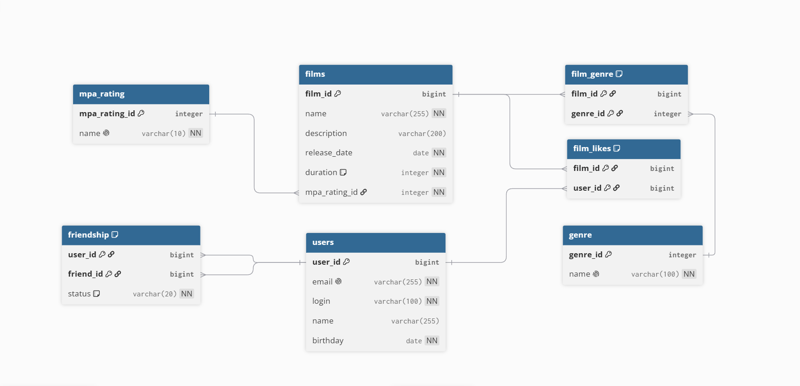

# java-filmorate

## Схема базы данных:


## Основные таблицы:
- **users** - хранит информацию о пользователях (email, логин, имя, дата рождения).
- **films** - хранит информацию о фильмах (название, описание, дата релиза, продолжительность, рейтинг MPA).

## Справочники:
- **mpa_rating** - рейтинги ассоциации кинокомпаний (G, PG, PG-13, R, NC-17).
- **genre** - жанры фильмов (Комедия, Драма, Мультфильм, Триллер, Документальный, Боевик).

## Связующие таблицы:
- **film_genre** - связь «многие-ко-многим» между фильмами и жанрами.
- **film_likes** - связь пользователей с фильмами, которые им нравятся.
- **friendship** - дружба между пользователями со статусом (pending или confirmed).

### Примеры запросов
1. **Получение всех фильмов**
```sql
SELECT * FROM films;
```
2. **Получение всех пользователей**
```sql
SELECT * FROM users;
```
3. **Получение пользователя по id**
```sql
SELECT * FROM users WHERE user_id = ?;
   ```
4. **Топ 10 фильмов по количеству лайков**
```sql
SELECT f.film_id, f.name
FROM films AS f
LEFT JOIN film_likes AS fl ON f.film_id = fl.film_id
GROUP BY f.film_id, f.name
ORDER BY COUNT(fl.user_id) DESC
LIMIT 10;
```
5. **Получение фильма с жанрами и рейтингом MPA**
```sql
SELECT f.film_id, f.name, f.description, f.release_date, f.duration,
       mr.name AS mpa_rating,
       g.name AS genre_name
FROM films AS f
JOIN mpa_rating AS mr ON f.mpa_rating_id = mr.mpa_rating_id
LEFT JOIN film_genre AS fg ON f.film_id = fg.film_id
LEFT JOIN genre AS g ON fg.genre_id = g.genre_id
WHERE f.film_id = ?;
```
6. **Общие друзья двух пользователей (подтверждённые)**
```sql
SELECT u.user_id, u.name
FROM friendship AS f1
JOIN friendship AS f2 ON f1.friend_id = f2.friend_id
JOIN users AS u ON u.user_id = f1.friend_id
WHERE f1.user_id = ?
  AND f2.user_id = ?
  AND f1.status = 'confirmed'
  AND f2.status = 'confirmed';
```
7. **Получение списка друзей пользователя с их статусами**
```sql
SELECT u.user_id, u.name, f.status AS friendship_status
FROM friendship AS f
JOIN users AS u ON u.user_id = f.friend_id
WHERE f.user_id = ?

UNION

SELECT u.user_id, u.name, f.status AS friendship_status
FROM friendship AS f
JOIN users AS u ON u.user_id = f.user_id
WHERE f.friend_id = ?
ORDER BY friendship_status DESC;
```
